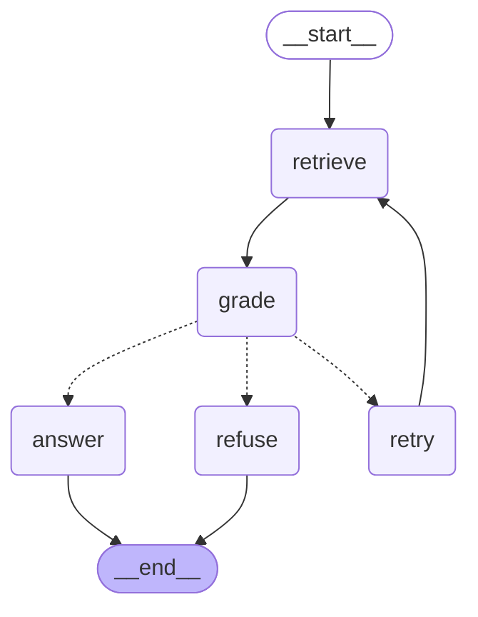

# RAG-Assistant-as-a-LangGraph-Agent

## Setup

git clone https://github.com/Bquinta1/Rebuild-the-RAG-Assistant-as-a-LangGraph-Agent.git

cd ticket_assistant

python -m venv .venv

.venv\Scripts\activate   

cd ..

pip install -e .

pip install -e ".[test]"

## Fill in .env with:

`AWS_REGION` | e.g. `us-east-1` 

`BEDROCK_MODEL_ID` | Bedrock model id used for grading and answering 

`BEDROCK_EMBED_MODEL_ID` | Bedrock embedding model id used for retrieval 

`BEDROCK_MAX_TOKENS` | optional, defaults to 600 

## Run

python -m ticket_assistant.graph

## Requirement 5 — uncovered question

asking "what are the countries you ship to?" will return with "Based on the provided document, I cannot provide a specific list of countries. The shipping policy states that the company ships to 14 countries, but it does not name them." since there are no documents that cover it

## Requirement 9 — "weak" and the retry

my grade_node asks the model whether the retrieved documents support an answer; if it's no, then it's weak. On retry, retry_node will broaden the query with the prior prompt turn. retrieve_node will increment attempts, and route_after_grade will only retry while `attempts < 2` — after that, it will return a fixed refusal instead.

## Graph

